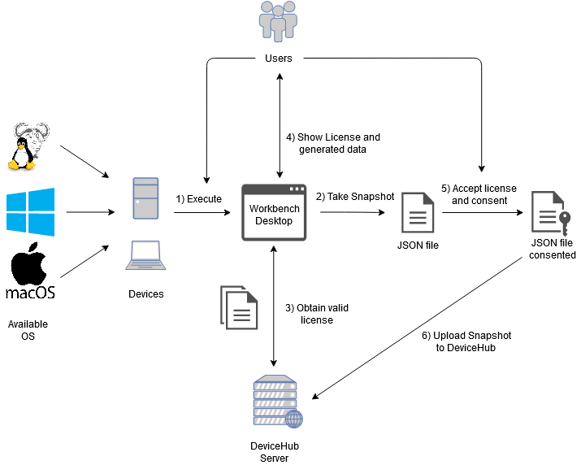

# eReuse.org Workbench Desktop

## What does this program do?

eReuse.org Workbench Desktop is a desktop cross-platform application which intends to extract information about the hardware of computer devices and deliver a snapshot.

## How it works?

## Available platforms

Instructions on dependencies, building, installation and usage

- [On Windows](./FOR-WINDOWS.md)
- [On MacOS](./FOR-MACOS.md)
- [On Linux](./FOR-LINUX.md)
